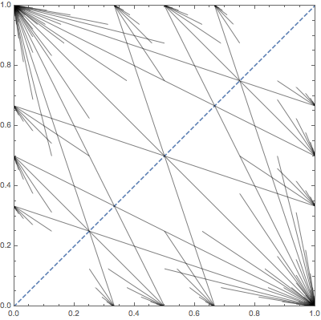
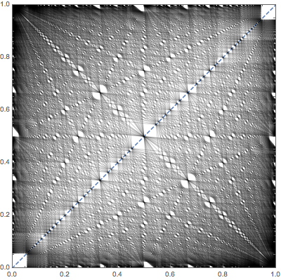

# Spectra of self-adjoint operators with four eigenvalues.

This Mathematica script is an optimized version of the code used by Marcin Bownik and John Jasper in their paper:
##### [Spectra of Frame Operators with Prescribed Frame Norms](http://pages.uoregon.edu/mbownik/papers/53.pdf)

The script computes all possible eigenvalue pairs `e1` and `e2` for an infinite dimensional self-adjoint operators (symmetric matrices) with diagonal entries formed by infinite sequences `beta^n` and `1-beta^n`, and exactly 4 eigenvalues `0<e1<e2<1`. 

The possible eigenvalue pairs create very interesting visualizations in 2D. For example `beta=0.5` and `beta=0.8` lead to:

### Optimizations

The original code (`old.nb`) involves depth-first approach through various nested mathematical definitions and a nonlinear optimization step. 

The optimal code precomputes values of some functions, eliminates optimization step, and tabularizes all repeating computations.

As a result:
* Constraint on multiplicity of eigenvalues is now eliminated, but that means that for `beta>0.95` computations slow down significantly. With `beta=0.98` there is about 20 million intervals to compute and draw.
* All computations can be performed using rational numbers, or much faster using compile machine-precision floats.
* Execution time decreased more than 10000 times. Finding images for `{beta, 0.752, 0.766, 0.002}` (8 values):
  - old script: 8 values computed in parallel, 1 threads each     - 1500 s
  - new script: 8 values computed in series, single threaded      - 0.007 s
  - new script: same but using rational numbers			  - 0.19 s 

### TODO
* Generalize the code to two arbitrary sequences of diagonal elements (one converging to 0, one to 1).
* Could we get a 3d image for 5-point spectrum operators?
